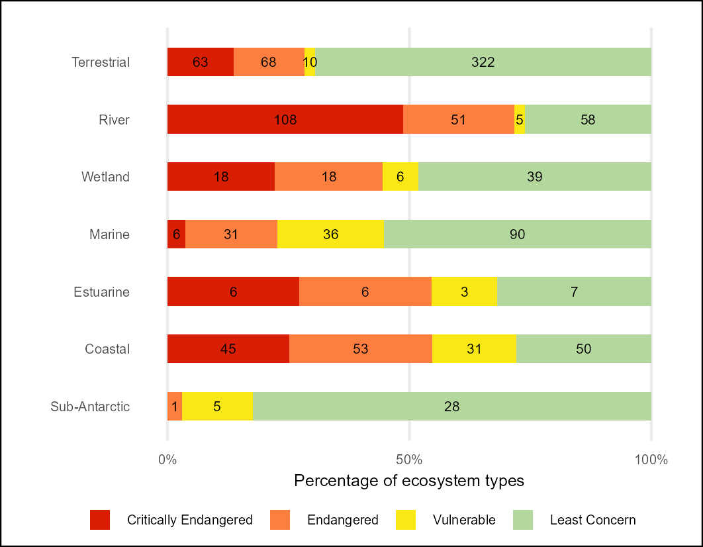
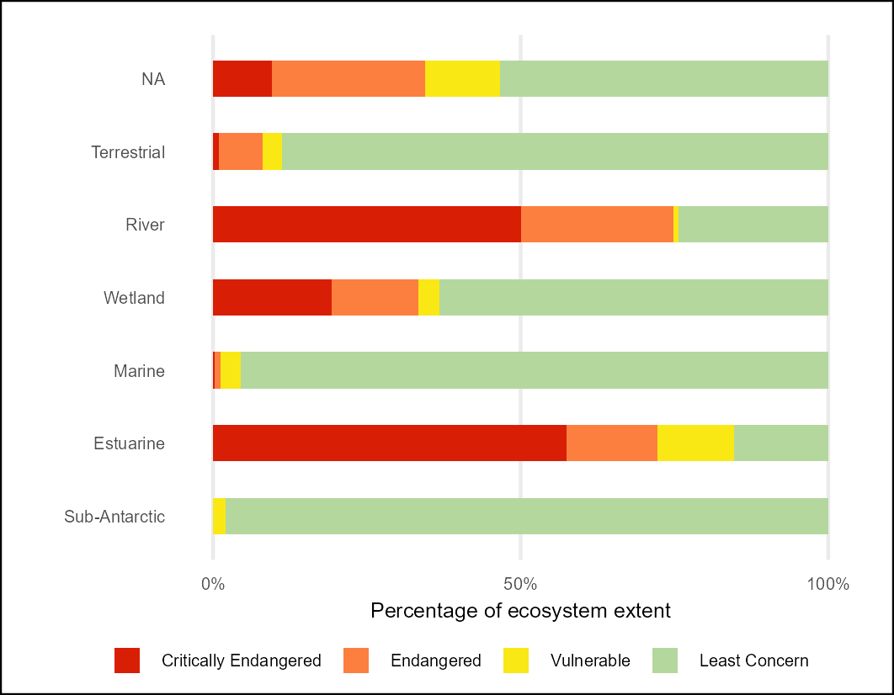

# Integrated ecosystem results for NBA 2025

Integrated (cross realm) RLE and EPL results for NBA 2025

Import Red List of Ecosystems (RLE) and Ecosystem Protection Level (EPL) results for South Africa's terrestrial, marine, freshwater (river and wetlands) and estuarine realms, and for the coastal zone (selected types from terrestrial, marine and estuarine realms), and for the marine sub-Antarctic territory of South Africa.

Terrestrial, marine, estuarine and freshwater assessments completed in 2025, the coastal zone results use these 2025 assessments, while for the sub-Antarctic the 2018 assessments are included.

**GitHub Repositories for each assessment detail the assessment workflows:**

<https://github.com/askowno/RLE_terr/>

<https://github.com/askowno/RLE_est/>

<https://github.com/askowno/RLE_wet/>

<https://github.com/askowno/RLE_riv/>

Marine:

<https://github.com/lrharris/nba2025_coast>

After importing the results for each realm they were combined in R tidyverse and plotted using ggplot2: [Realm_results.qmd](Realm_results.qmd)

## Results

**Using RLE for all realms:**

Integrated ecosystem results : [outputs/rle_count_per_realm.csv](outputs/rle_count_per_realm.csv); [outputs/rle_ext_per_realm.csv](outputs/rle_ext_per_realm.csv)

**Using van Deventer et al., 2019 methods for Wetlands and Rivers:**

Integrated ecosystem results : [outputs/rle_count_per_realm_sa.csv](outputs/rle_count_per_realm_sa.csv) ; [outputs/rle_ext_per_realm_sa.csv](outputs/rle_ext_per_realm_sa.csv)

**Ecosystem Protection Level for all realms:**

Integrated ecosystem results: [outputs/epl_count_per_realm.csv](outputs/epl_count_per_realm.csv);[outputs/epl_ext_per_realm.csv](outputs/epl_ext_per_realm.csv)

| Count of Types - RLE approach all realms | Extent of Types - RLE approach all realms |
|----|----|
|  |  |
|  |  |

| Count of Types per realm (ETS riv and wet) | Extent of Types per realm (ETS riv and wet) |
|-----------------------------------------------|-------------------------|
|  |  |

Note: High resolution pdf versions of these plots, with embedded fonts, can be found within the outputs folder
