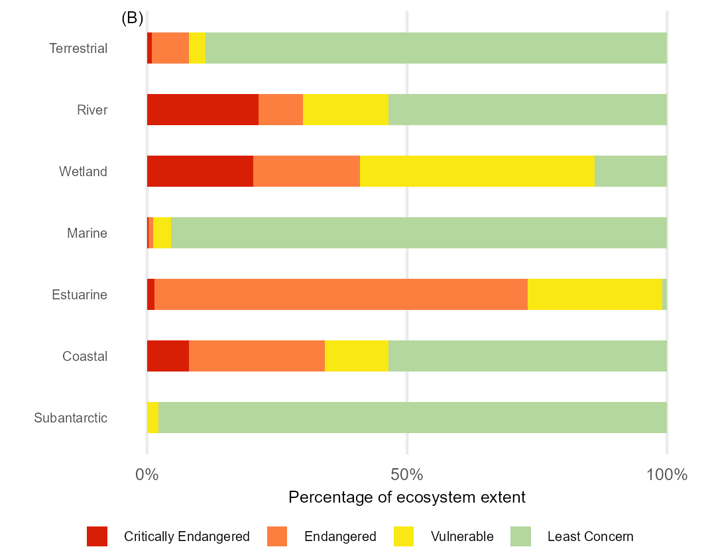
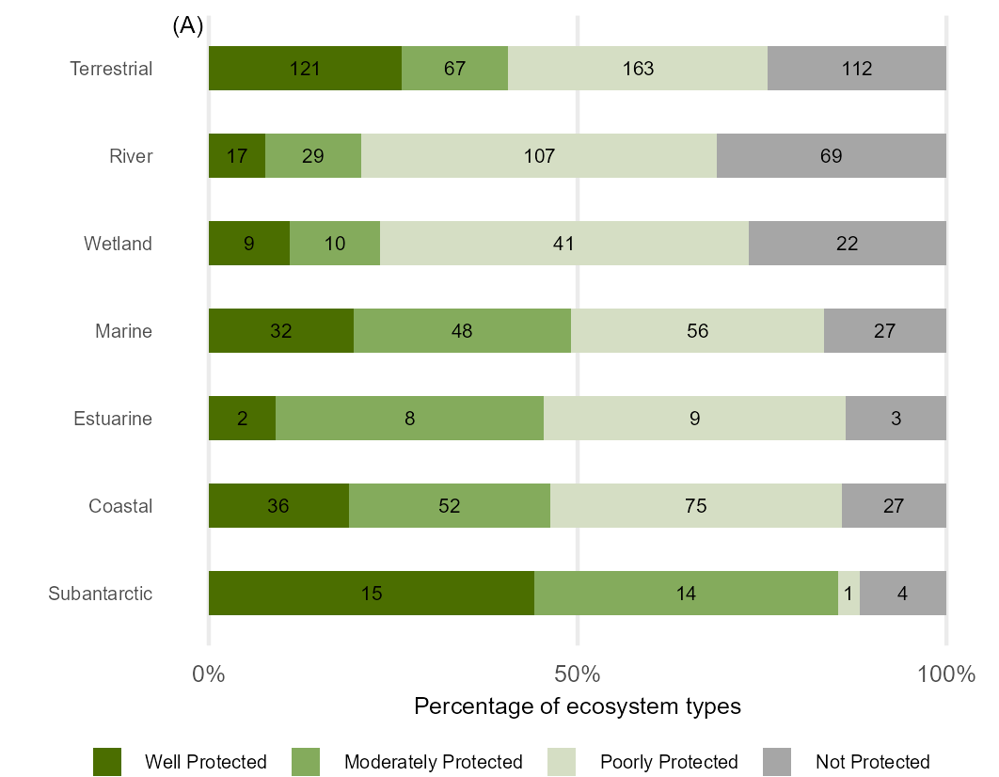

# Integrated ecosystem results for NBA 2025

Integrated (cross realm) RLE and EPL results for NBA 2025

Import Red List of Ecosystems (RLE) and Ecosystem Protection Level (EPL) results for South Africa's terrestrial, marine, freshwater (river and wetlands) and estuarine realms, and for the coastal zone (selected types from terrestrial, marine and estuarine realms), and for the marine sub-Antarctic territory of South Africa.

Terrestial, marine, estuarine and freshwater assessments completed in 2025, the coastal zone results use these 2025 assessments, while for the sub-Antarctic the 2018 assessments are included.

**GitHub Repositories for each assessment detail the assessment workflows:**

RLE_ter and EPL_ter

RLE_est and EPL_est

RLE_riv and EPL_riv

RLE_wet and EPL wet

Marine

Coastal

After importing all the results for eah realm they were combined in R tidyverse and plotted using ggplot2:

[RLE_realm.qmd](RLE_realm.qmd)

[EPL_realm.qmd](EPL_realm.qmd)

## Results

| Count of Types | Extent of Types |
|----|----|
|  |  |
|  | {width="486"} |
